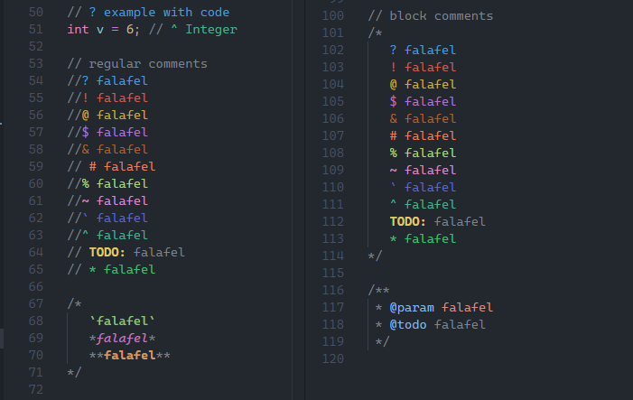
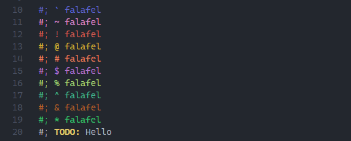
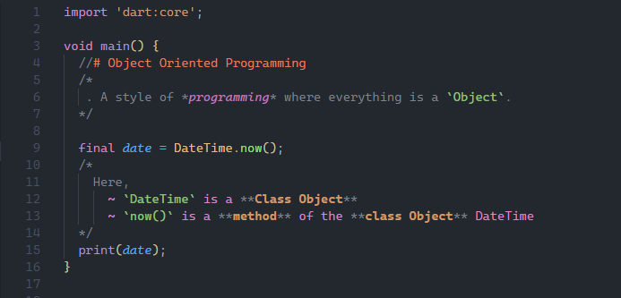

# Styled Comments

Highlight specially marked comments in different colours to make *notes*, *warnings*, *TODOs*, and *annotations* stand out while coding. And it *doesn't* affect **Doxygen** or **JSDoc**. **MarkDown Delimiters** are also supported.



## Features

Styled Comments applies colours **only inside real comments** (line comments and block comments) and supports many languages and even .txt files (`#;`).

Example for text files:



### Simple Markdown support

You can use **Markdown delimiters** (`` ` ``, `*`, `**`) to format words like Markdown. This is supported with line **highlighters**/**decorators** ( `?`, `*`, `!`, `@`, `$`, `&` , `#`, `%`, `~`, `` ` ``, `^`).  

However the comment line *must start* with any **non-Alphanumeric symbol**. If you have a **Alphanumeric** (`abcd...`,`123...`) in front of the comment line then you'll have use a **Full stop**(`.`). [ *period in american English* ]



### Supported Decorator symbols

| Symbol | Meaning | Style |
|--------|---------|-------|
| `?` | Question / uncertainty | Blue |
| `*` | Important note | green |
| `!` | Warning / alert | Red |
| `@` | Mention / reference | Yellow |
| `TODO:` | Task / reminder | **Bold + yellow** |
| `$` | Cost / money related | Purple |
| `&` | Connection / related info | Brown |
| `#` | Tag / category | Orange |
| `%` | Performance / metrics | Lime green |
| `~` | Approximate / soft note | Pink |
| `` ` `` | Code / technical detail | Blue |
| `^` | Improvement / optimization | Teal |

## Support

Currently This supports the following languages `id`(s) :

- `dart`
- `csharp`
- `java`
- `go`
- `groovy`
- `c`
- `cpp`
- `asm`
- `nasm`
- `llvm`
- `gas`
- `rust`
- `zig`
- `odin`
- `powershell`
- `shellscript`
- `python`
- `cmake`
- `lua`
- `jsonc`
- `sql`
- `html`
- `css`
- `plaintext`
- `javascript`
- `typescript`
- `javascriptreact`
- `typescriptreact`

## Usage

Simply place one of the supported symbols **at the start of a comment**.

### Line comments

<code style="color : #449edaff">// ? What should this function return?</code><br>
<code style="color : #34c06eff">// * This is really important!</code><br>
<code style="color : #ce5d50ff">// ! Warning: This might cause issues</code><br>
<code style="color : #ccad31ff">// @ Remember to check with John</code><br>
<code style="color : #e2ca6bff">// <b>TODO:</b></code><code>Fix this bug</code><br>
<code style="color : #b375cc">// $ This costs $50 per month</code><br>
<code style="color : #b16127">// & Related to the user authentication</code><br>
<code style="color : #e67f59ff">// # Feature: Login system</code><br>
<code style="color : #a9d676ff">// % Performance impact needs review</code><br>
<code style="color : #db89c7ff">// ~ Approximately correct behaviour</code><br>
<code style="color : #5f66cc">// ` This involves low-level code</code><br>
<code style="color : #41b48e">// ^ Can be optimized later</code>

- Same can be done with *block comments*.

### Simple Markdown

- use `` ` `` delimiter for highlighting a single word Green
- use `` * `` delimiter for highlighting a single word Purple and *italic*
- use `` ** `` delimiter for highlighting a single word Gold and **Bold**

## Known Issues

1. `*` specifically requires that you write like:

```sh
// *
```

and not like this:

```sh
//*
```

## contributions

I would love any help you can provide.
You can help by,

- Starring the project on [Github](https://github.com/Alec269/styled-comments-vscode.git)
- Finding and reporting [issues](https://github.com/Alec269/styled-comments-vscode/issues)
- Suggesting possible fixes for known [issues](https://github.com/Alec269/styled-comments-vscode/issues)

😢 I'm sorry if there are issues that haven't been fixed, yet. I'm just a student and I'm not good at `Typescript`.
